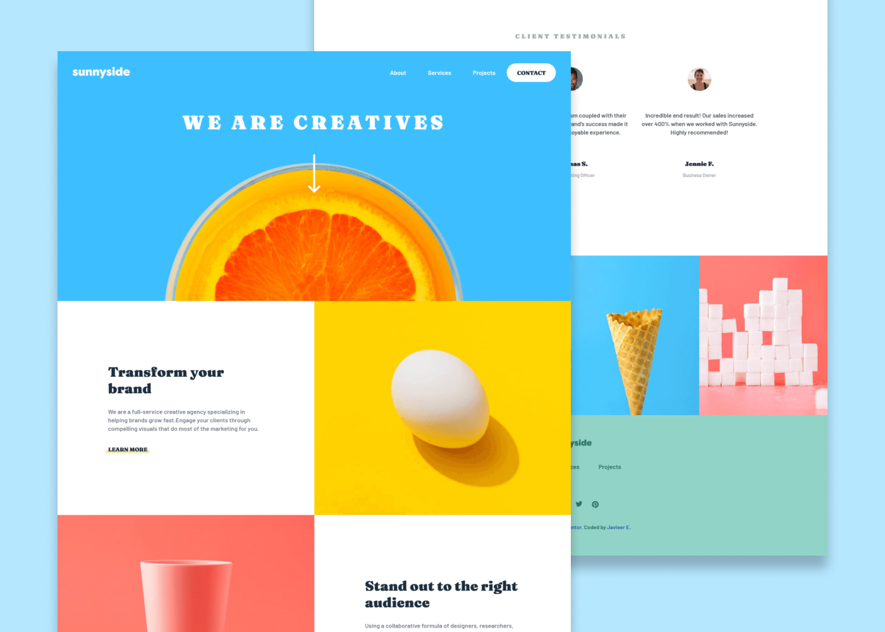

# Frontend Mentor - Sunnyside agency landing page solution

This is a solution to the [Sunnyside agency landing page challenge on Frontend Mentor](https://www.frontendmentor.io/challenges/sunnyside-agency-landing-page-7yVs3B6ef).

## Table of contents

-   [Screenshot](#screenshot)
-   [Links](#links)
-   [My process](#my-process)
    -   [Built with](#built-with)
    -   [What I learned](#what-i-learned)
    -   [Continued development](#continued-development)
-   [Author](#author)
-   [Acknowledgments](#acknowledgments)

### Screenshot



### Links

-   Solution URL: [https://www.frontendmentor.io/solutions/responsive-landing-page-using-js-and-sass-t12w9CKNC](https://www.frontendmentor.io/solutions/responsive-landing-page-using-js-and-sass-t12w9CKNC)
-   Github Pages: [https://javieer57.github.io/sunnyside-agency-landing-page/](https://javieer57.github.io/sunnyside-agency-landing-page/)

## My process

### Built with

-   Semantic HTML5 markup
-   SASS
-   CSS custom properties
-   Flexbox
-   CSS Grid
-   Javascript

### What I learned

The first time I saw the hamburger menu, I thought I have to code two menus (one for desktop and another for mobile). Finally, decided to change the css styles for the menu and it was less complicated.

Also, in my first try of code the header I used position absolute in the menu. However, found a way of not use that and the result was a less complicated and maintainable code.

During the challenge I force myself to use more BEM methodology and learned how to combine it with SASS... everyone should use it, it was really easy to use and feel my code is more maintainable and easy to understand.

```sass
.footer
    &__logo
    &__link
    &__icon
```

### Continued development

I'll like to continue learning about BEM methodology. Normally I don't apply any methodology when writing classes (it's not the best choice, I know) and found it pretty useful.

Further, I'll focus more on writing reusable CSS to improve this part.

## Author

-   Frontend Mentor - [@Javieer57](https://www.frontendmentor.io/profile/Javieer57)
-   Github - [@Javieer57](https://github.com/Javieer57)
-   Instagram - [@javieer57](https://www.instagram.com/javieer_57/)

## Acknowledgments

During this challenge, I guided in the videos from [TheCoderCoder](https://www.youtube.com/c/TheCoderCoder) about frontend mentor challenges. It was really helpful to see the workflow from a senior programmer and also help me to gain more confidence in my journey during this process. Thank you Coder Coder :) <3
